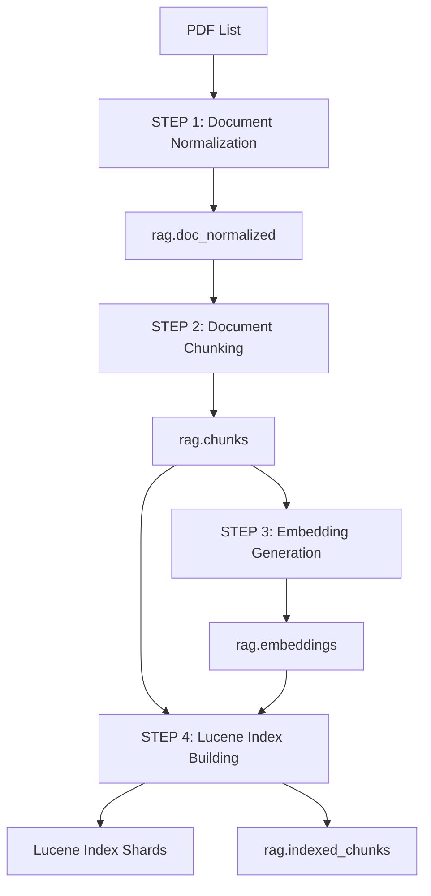

# RAG Pipeline Documentation

# Youtube video-- https://www.youtube.com/watch?v=HLwyP9LjCLk

A complete **Retrieval-Augmented Generation (RAG)** pipeline built with Scala, Apache Spark, Delta Lake, and Lucene. Process PDF documents, generate embeddings, and build searchable vector indexes for efficient semantic search and retrieval.

---

## 📋 Table of Contents
 GO To - [Results/Audit Logs](#-resultsaudit-logs)

- [Architecture](#-architecture)
- [Pipeline Flow](#-pipeline-flow)
  - [Step 1: Document Normalization](#step-1-document-normalization)
  - [Step 2: Document Chunking](#step-2-document-chunking)
  - [Step 3: Embedding Generation](#step-3-embedding-generation)
  - [Step 4: Lucene Index Building](#step-4-lucene-index-building)
- [Data Flow](#-data-flow)
- [Results/Audit Logs](#-resultsaudit-logs)
- [Getting Started](#-getting-started)
  - [Prerequisites](#prerequisites)
  - [Local Mode](#local-mode)
  - [EMR Mode](#emr-mode)
- [Search Query Flow](#search-query-flow)
- [Configuration](#configuration)
- [Incremental Updates](#-incremental-updates)
- [Performance](#-performance)
- [Troubleshooting](#-troubleshooting)

---

## 🏗 Architecture

The pipeline transforms raw PDFs into a searchable vector index through four stages:

```
PDFs → Normalize → Chunk → Embed → Index
  ↓        ↓         ↓       ↓       ↓
Input   Delta    Delta   Delta   Lucene
Files   Table    Table   Table   Shards
```

**Key Features:**
- ✅ Incremental processing (only new/changed content)
- ✅ ACID transactions via Delta Lake
- ✅ Distributed processing on EMR
- ✅ Comprehensive audit logging
- ✅ S3 integration

---

## 🔄 Pipeline Flow

### Step 1: Document Normalization

> **Class:** `RAGDocNormalized`

Extract and normalize text from PDF documents.

**Input:**
- Text file with PDF URIs (one per line)
- Supports: local filesystem, S3, HTTP

**Process:**
1. Extract text from PDFs using Apache PDFBox
2. Normalize whitespace
3. Generate metadata (docId, contentHash, title)
4. Compare with existing documents
5. Upsert only new/modified documents

**Output:** Delta table `rag.doc_normalized`

```
Schema: docId, uri, text, contentHash, language, title, version_ts
```

<details>
<summary><b>Key Features</b></summary>

- **Parallel processing:** Repartitioned across 10 partitions
- **Error handling:** Corrupted PDFs don't stop pipeline
- **Multi-protocol:** S3, local, and HTTP URIs
- **Change detection:** SHA-256 content hashing
</details>

---

### Step 2: Document Chunking

> **Class:** `RAGChunks`

Split documents into overlapping chunks for better embedding and retrieval.

**Input:** Delta table `rag.doc_normalized`

**Process:**
1. Load normalized documents
2. Identify documents needing chunking
3. Split into chunks (1200 chars, 200 char overlap)
4. Generate chunk metadata
5. Upsert chunks into Delta table

**Output:** Delta table `rag.chunks`

```
Schema: chunkId, docId, docHash, offset, chunk, chunkHash, language, title, version_ts
```

<details>
<summary><b>Chunking Strategy</b></summary>

- **Max size:** 1200 characters (fits embedding model limits)
- **Overlap:** 200 characters (preserves context)
- **IDs:** Position-based (deterministic)
- **Optimization:** Two-level (document + chunk)
</details>

---

### Step 3: Embedding Generation

> **Class:** `RAGEmbeddings`

Generate vector embeddings for each chunk using Ollama.

**Input:** Delta table `rag.chunks`

**Process:**
1. Load chunks from Delta table
2. Identify chunks needing embeddings
3. Generate embeddings in batches via Ollama
4. Normalize vectors (L2 normalization)
5. Upsert embeddings into Delta table

**Output:** Delta table `rag.embeddings`

```
Schema: chunkId, chunkHash, embedder, embedder_ver, vector, version_ts
```

<details>
<summary><b>Embedding Details</b></summary>

- **Model:** mxbai-embed-large (configurable)
- **Normalization:** L2 for cosine similarity
- **Batch processing:** Prevents memory issues
- **Skip mode:** For EMR (pre-compute locally)
</details>

---

### Step 4: Lucene Index Building

> **Class:** `RagLuceneIndex`

Build distributed Lucene indexes for vector similarity search.

**Input:** 
- Delta table `rag.chunks`
- Delta table `rag.embeddings`

**Process:**
1. Join chunks with embeddings
2. Identify chunks needing indexing
3. Partition into shards (CRC32 hashing)
4. Build Lucene indexes in parallel
5. Sync to S3 if needed

**Output:** 
- Lucene index shards in `Config.indexPath/shard_N/`
- Delta table `rag.indexed_chunks`

<details>
<summary><b>Index Structure</b></summary>

Each Lucene document contains:
- **StringField:** doc_id, chunk_id, chunk_hash
- **TextField:** text (searchable)
- **LongPoint:** offset (range queries)
- **KnnFloatVectorField:** vector (similarity search)

**Similarity Functions:**
- COSINE (default)
- EUCLIDEAN
- DOT_PRODUCT
</details>

---

## 📊 Data Flow



---

## 📝 Results(Audit Logs)

The `AuditLogger` tracks every pipeline execution with detailed metrics and status updates.

### 📍 Log Location

**GitHub Repository:** [View Complete Audit Logs](https://github.com/its-Shivam732/RagSpark/blob/main/RagSpark/ResultAuditLog/rag_audit.log) 
NOTE----these are just sample on few pdfs from MSR corpus ran on local.

### 🔍 Understanding the Results/Audit Log

The audit log shows **three complete pipeline runs** demonstrating incremental processing:

#### **Run 1: Initial Pipeline (First Run)**
*Duration: 49 seconds (15:55:27 - 15:56:16)*

```
🚀 NEW PIPELINE RUN STARTING AT: 2025-11-02T15:55:27
```

| Step | What Happened | Metrics |
|------|---------------|---------|
| **Step 1: Document Normalization** | First run - created Delta table | 7 PDFs → 7 documents extracted |
| **Step 2: Document Chunking** | First run - created chunks table | 7 docs → 1,604 chunks |
| **Step 3: Embedding Generation** | First run - created embeddings table | 1,604 chunks → 1,604 embeddings (51 batches) |
| **Step 4: Lucene Index Building** | First run - created index | 1,370 chunks indexed across 4 shards |

**Key Observations:**
- ✅ All data is new (first run)
- ✅ Created all Delta tables from scratch
- ✅ Pipeline completed successfully in ~49 seconds
- 📊 **Efficiency note:** Only 1,370 out of 1,604 chunks indexed (234 chunks filtered due to empty/invalid vectors)

---

#### **Run 2: Incremental Update (2 New PDFs Added)**
*Duration: 39 seconds (15:58:54 - 15:59:33)*

```
🚀 NEW PIPELINE RUN STARTING AT: 2025-11-02T15:58:54
```

| Step | What Happened | Metrics |
|------|---------------|---------|
| **Step 1: Document Normalization** | Detected 2 new PDFs | 9 PDFs in list → 2 NEW documents |
| **Step 2: Document Chunking** | Chunked only new documents | 2 docs → 440 new chunks |
| **Step 3: Embedding Generation** | Generated embeddings for new chunks | 440 chunks → 440 embeddings (14 batches) |
| **Step 4: Lucene Index Building** | Indexed only new chunks | 440 INSERTS → Total: 1,810 indexed |

**Key Observations:**
- ✅ **Incremental processing:** Only 2 new documents processed
- ✅ **Skip existing:** 7 existing documents untouched
- ✅ **Net change:** +2 documents, +440 chunks, +440 embeddings
- ⚡ **Faster:** Completed in 39 seconds (vs 49 for full pipeline)

---

#### **Run 3: Content Update (1 PDF Modified)**
*Duration: 28 seconds (16:01:38 - 16:02:06)*

```
🚀 NEW PIPELINE RUN STARTING AT: 2025-11-02T16:01:38
```

| Step | What Happened | Metrics |
|------|---------------|---------|
| **Step 1: Document Normalization** | Detected 1 changed document | 9 PDFs → 1 CHANGED: `MSR.2007.19.pdf` |
| **Step 2: Document Chunking** | Re-chunked modified document | 1 doc → 217 chunks generated, **1 chunk changed** |
| **Step 3: Embedding Generation** | Re-embedded changed chunk | **1 chunk** → 1 embedding (1 batch) |
| **Step 4: Lucene Index Building** | Updated index for changed chunk | **1 UPDATE** (deleted old, added new) |

**Key Observations:**
- ✅ **Content change detection:** SHA-256 hash detected modified content
- ✅ **Chunk-level optimization:** Only 1 out of 217 chunks actually changed
- ✅ **Update operation:** Deleted old chunk, added new one
- ⚡ **Super fast:** Completed in 28 seconds (only 1 chunk processed)

---

#### **Run 4+: No Changes Detected**
*Duration: ~5 seconds (22:12:44 - 22:12:57)*

```
🚀 NEW PIPELINE RUN STARTING AT: 2025-11-02T22:12:44
```

| Step | Status | Message |
|------|--------|---------|
| **Step 1** | ⏭️ Skipped | (No Step 1 log - ran steps 2-4 independently) |
| **Step 2** | ✅ Skipped | `NO DOCUMENTS NEED RE-CHUNKING` |
| **Step 3** | ✅ Skipped | `NO CHUNKS NEED EMBEDDING` |
| **Step 4** | ✅ Skipped | `NO NEW OR UPDATED CHUNKS TO INDEX` |

**Key Observations:**
- ✅ **Nothing to do:** All content up-to-date
- ✅ **Lightning fast:** Completed in ~5 seconds
- ✅ **Idempotent:** Safe to re-run pipeline anytime
- 💰 **Cost efficient:** No compute wasted on unchanged data

---

### 📊 Log Patterns Explained

#### **Pipeline Start**
```
================================================================================
🚀 NEW PIPELINE RUN STARTING AT: 2025-11-02T15:55:27
================================================================================
STEP 1: Document Normalization
--------------------------------------------------------------------------------
```
- Marks beginning of new pipeline execution
- Timestamp for tracking duration
- Visual separators for readability

---

#### **Step 1: Document Normalization**
```
Total PDFs in input list: 9
Found existing Delta table with 9 documents
PDF extraction: 9 successful, 0 failed
Found 2 NEW or CHANGED documents (out of 9 total)
  - NEW documents: 2
  - CHANGED documents (content updated): 0
Delta table before: 7 docs, after: 9 docs
Net change: +2 documents
✅ STEP 1 COMPLETE
```

**What to look for:**
- **Input size:** Total PDFs to process
- **Success rate:** How many PDFs extracted successfully
- **Change breakdown:** New vs modified documents
- **Delta stats:** Before/after counts and net change
- **Status:** ✅ (success) or ❌ (failure)

---

#### **Step 2: Document Chunking**
```
Loaded 9 documents from rag.doc_normalized
Found existing chunks table with 9 unique documents
Found 2 documents needing chunking (new or content changed)
Generated 440 chunks from 2 documents
Chunks to upsert: 440 (new or content changed)
Chunks table updated (after: 2044 chunks, added: 440)
✅ STEP 2 COMPLETE: rag.chunks updated
```

**What to look for:**
- **Input:** Documents loaded from previous step
- **Incremental:** How many docs need chunking
- **Chunk generation:** Total chunks created
- **Optimization:** Chunks filtered (unchanged content)
- **Delta stats:** Total chunks and additions

---

#### **Step 3: Embedding Generation**
```
Loaded 2044 chunks from rag.chunks
Using embedding model: mxbai-embed-large v1.3.0
Found existing embeddings table with 1604 chunks
Found 440 chunks needing embeddings (new or content changed)
Generating embeddings in 14 batches (batch size: 32)
Embedding results: 440 successful, 0 failed
Embeddings table updated (after: 2044, added: 440)
✅ STEP 3 COMPLETE: rag.embeddings updated
```

**What to look for:**
- **Model info:** Which embedding model and version
- **Incremental:** Only new/modified chunks embedded
- **Batch processing:** Number of batches (shows progress)
- **Success rate:** Successful vs failed embeddings
- **Performance:** Time per batch (visible in timestamps)

---

#### **Step 4: Lucene Index Building**
```
Loaded 2044 chunks from rag.chunks
Loaded 2044 embeddings from rag.embeddings
After join: 1810 chunks with valid embeddings
Found 440 chunks needing indexing (new or content changed)
  - INSERTS (new chunks): 440
  - UPDATES (content changed): 0
Partitioning data into 4 shards (keeping documents together)
Shard distribution:
  Shard  2:    223 chunks from 1 documents
  Shard  3:    217 chunks from 1 documents
Using vector similarity function: COSINE
================================================================================
Lucene Index Build/Update Summary:
================================================================================
Shard  0: added=   223  updated=     0
Shard  3: added=   217  updated=     0
================================================================================
Index Statistics:
  Total shards: 4
  Total documents added: 440
  Total documents updated: 0
================================================================================
✅ STEP 4 COMPLETE: Lucene index updated successfully
================================================================================
PIPELINE RUN COMPLETED SUCCESSFULLY
================================================================================
```

**What to look for:**
- **Join stats:** Chunks with valid embeddings
- **Insert vs Update:** New chunks vs modified chunks
- **Shard distribution:** How chunks distributed across shards
- **Per-shard metrics:** Added/updated counts per shard
- **Total statistics:** Overall index operations
- **Completion status:** Success/failure indicator

---

### 🎯 Key Metrics to Monitor

| Metric | Where to Find | What It Means |
|--------|---------------|---------------|
| **Processing Time** | Start/end timestamps | Pipeline performance |
| **Success Rate** | "X successful, Y failed" | Data quality issues |
| **Incremental Efficiency** | "Found X needing..." | How much skipped |
| **Batch Performance** | Embedding generation | Ollama service health |
| **Shard Distribution** | Step 4 shard stats | Load balancing |
| **Net Changes** | Delta before/after | Actual data changes |

---


---

## 🚀 Getting Started

### Prerequisites

**Software:**
- Scala 2.12.18
- Apache Spark 3.5.3
- SBT version 1.11.7
- Java 11)

**For Embeddings:**
- Ollama service
- Model: `ollama pull mxbai-embed-large`

**For EMR:**
- AWS credentials
- S3 bucket with permissions
- EMR cluster

### Local Mode

#### 1. Build the project

```bash
sbt clean compile assembly
```

#### 2. Prepare input file

Create `pdfs.txt`:
```
/path/to/document1.pdf
/path/to/document2.pdf
s3://bucket/document3.pdf
```

#### 3. Start Ollama

```bash
ollama serve
```

#### 4. Run pipeline

**Full pipeline (chained):**
```bash
 spark-submit --class com.rag.RAGDocNormalized --master "local[*]" /Users/moudgil/RagSpark/RagSpark/target/scala-2.12/RagSpark-assembly-0.1.0-SNAPSHOT.jar file:///Users/moudgil/RagSpark/RagSpark/pdf_list.txt file:///Users/moudgil/output/rag.doc_normalized

```

#### 5. Monitor logs

```bash
tail -f /Users/moudgil/output/logs/rag_audit.log
```

---

### EMR Mode

#### 1. Upload to S3

```bash
# JAR
aws s3 cp target/scala-2.12/rag-assembly-1.0.jar s3://your-bucket/jars/

# Input
aws s3 cp pdfs.txt s3://your-bucket/input/
```

#### 2. Run on EMR
Run on main ec2 instance of cluster.

```bash
spark-submit \
  --class com.rag.RAGDocNormalized \
  --master yarn \
  --deploy-mode cluster \
  --conf spark.sql.extensions=io.delta.sql.DeltaSparkSessionExtension \
  --conf spark.sql.catalog.spark_catalog=org.apache.spark.sql.delta.catalog.DeltaCatalog \
  --conf spark.executor.memory=4g \
  --conf spark.driver.memory=4g \
  --conf spark.executor.cores=2 \
  --packages io.delta:delta-core_2.12:2.4.0 \
  RagSpark-assembly-0.1.0-SNAPSHOT.jar \
  s3://sparkrmr/pdf_list.txt \
  s3://sparkrmr/rag-data/

```


#### 3. Monitor

```bash
# List logs
aws s3 ls s3://your-bucket/rag-data/logs/ --recursive
```


---


## Search Query Flow
1. **Embed Query**: Use Ollama to generate query vector.
2. **Search**: `RagSearch.searchAllShards` (fan-out to shards).
3. **Retrieve Context**: Pack top-k results into prompt.
4. **Generate Answer**: Use Ollama chat API with system/user messages.
5. **Response**: Answer + sources + metadata.

**Query Example** (cURL): curl -X POST http://localhost:8080/api/v1/query \
  -H "Content-Type: application/json" \
  -d '{
    "query": "seasonal decomposition time series analysis to TravisTorrent data",
    "topK": 5,
    "embedModel": "mxbai-embed-large",
    "chatModel": "llama3"
  }'


## Configuration

Configuration is centralized in `Config` object:

```scala
object Config {
  val isEMR = sys.env.get("EMR_MODE").contains("true")
  
  val basePath = if (isEMR) "s3://your-bucket/rag" else "/Users/moudgil/output"
  val docNormalizedPath = s"$basePath/delta/doc_normalized"
  val chunksPath = s"$basePath/delta/chunks"
  val embeddingsPath = s"$basePath/delta/embeddings"
  val indexPath = s"$basePath/lucene_index"
  
  val embedModel = "mxbai-embed-large"
  val embedVer = "v1"
  val batchSize = 50
  val numShards = 4
}
```

### Environment Variables

| Variable | Values | Purpose |
|----------|--------|---------|
| `EMR_MODE` | true/false | Enable EMR mode (S3 paths) |
| `RUN_FULL_PIPELINE` | true/false | Chain all steps automatically |
| `SKIP_EMBEDDING` | true/false | Skip embedding generation |
| `RAG_SIMILARITY` | COSINE/EUCLIDEAN/DOT_PRODUCT | Vector similarity function |

---

## 🔄 Incremental Updates

The pipeline processes **only new or modified content** at each stage.

### How It Works

1. **Content hashing:** SHA-256 of text/chunks
2. **Change detection:** Compare with existing Delta tables
3. **Granular updates:** Document, chunk, and index level

### Example Scenarios

| Scenario | Step 1 | Step 2 | Step 3 | Step 4 |
|----------|--------|--------|--------|--------|
| **New PDF** | Extract | Chunk all | Embed all | Index all |
| **Content changed** | Extract | Re-chunk | Re-embed changed | Re-index changed |
| **No changes** | Skip | Skip | Skip | Skip ✨ |

### Benefits

- ✅ **Efficiency:** Process only what changed
- ✅ **Cost savings:** Important for expensive embeddings
- ✅ **Fast iterations:** Re-run pipeline frequently
- ✅ **Idempotent:** Safe to run multiple times

---

---

## ⚡ Performance

### Optimization Tips

**Batch Size (Embeddings):**
- Small (10-20): Lower memory, slower
- Large (50-100): Higher memory, faster

**Number of Shards (Indexing):**
- More shards = more parallelism
- Recommended: 1 shard per 10-50GB

**Spark Partitions:**
- PDF extraction: 10 (I/O bound)
- Chunking: Default (CPU bound)
- Embeddings: 1 (sequential)
- Indexing: numShards (parallel)

### Delta Lake Optimization

```scala
spark.sql("OPTIMIZE rag.chunks")
spark.sql("OPTIMIZE rag.embeddings")
```

---

## 🔧 Troubleshooting

| Issue | Solution |
|-------|----------|
| **Out of Memory** | Reduce `batchSize` in Config |
| **Ollama Connection Failed** | Check if service running: `ollama serve` |
| **S3 Access Denied** | Verify EMR role has S3 permissions |
| **Delta Table Not Found** | First run - tables created automatically |
| **Index Corruption** | Delete index dir and rebuild |

---

## 🛠 Technology Stack

| Category | Technology |
|----------|------------|
| **Language** | Scala 2.12.18 |
| **Processing** | Apache Spark 3.5.3 |
| **Embeddings** | Ollama (mxbai-embed-large) |
| **Infrastructure** | AWS EMR, S3 |

---

## 📚 Next Steps

After running the pipeline:

1. ✅ Query the index using Lucene API
2. ✅ Build RAG application with LLM
3. ✅ Add more documents (update pdfs.txt)
4. ✅ Tune performance (batch sizes, shards)
5. ✅ Monitor metrics in audit logs

---

